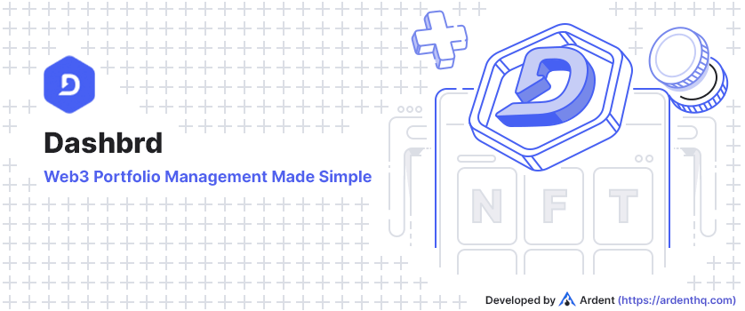

# Dashbrd

Dashbrd is a versatile app that acts as a crypto wallet supporting Polygon and Ethereum networks, while also serving as a platform for users to discover, exhibit, and showcase their NFT collections through interactive galleries.

## Development Setup

Please have a look at the dedicated [setup](SETUP.md) document to get started

## Contributing

Dashbrd is still a work in progress, but it's actively build in public and we welcome outside contributions. Please have a look at our [Contribution guidelines](CONTRIBUTING.md) for more details on how you can help.

## Roadmap

We'll provide a more detailed roadmap in due time. Until then, please have a look at the [Issues](../../issues) and [Discussions](../../discussions) tabs in this repository where you will find some highlights of what's to come / what's being worked on.

## Credits

This project exists thanks to all the people who [contribute](../../contributors).

## AS-IS Clause

Dashbrd is provided "AS-IS" and without any warranty of any kind, whether express, implied or statutory, including but not limited to the warranties of merchantability, fitness for a particular purpose, and non-infringement. The entire risk as to the quality and performance of Dashbrd is with you. Should Dashbrd prove defective, you assume the cost of all necessary servicing, repair, or correction.

In no event shall the author of Dashbrd be liable to you or any third parties for any damages arising out of or in connection with the use or inability to use Dashbrd, including but not limited to damages for loss of profits, business interruption, or loss of data, even if the author of Dashbrd has been advised of the possibility of such damages.

By using Dashbrd, you agree to indemnify and hold harmless the author of Dashbrd and any contributors to Dashbrd from and against any claims, actions, or demands, including without limitation reasonable legal and accounting fees, arising from or related to your use of Dashbrd or your violation of these terms and conditions.

## Copyright

Dashbrd is an open-source app that acts as a crypto wallet supporting Polygon and Ethereum networks, while also serving as a platform for users to discover, exhibit, and showcase their NFT collections through interactive galleries, hereinafter referred to as "the Program". The Program is licensed under the terms of the GNU General Public License version 3 ("GPLv3").

Copyright (C) 2023 [Ardent](https://ardenthq.com/)

This program is free software: you can redistribute it and/or modify
it under the terms of the GNU General Public License as published by
the Free Software Foundation, either version 3 of the License, or
(at your option) any later version.

This program is distributed in the hope that it will be useful,
but WITHOUT ANY WARRANTY; without even the implied warranty of
MERCHANTABILITY or FITNESS FOR A PARTICULAR PURPOSE. See the
GNU General Public License for more details.

You should have received a copy of the GNU General Public License
along with this program. If not, see <https://www.gnu.org/licenses/>.

## License

[GNU General Public License v3.0](LICENSE) © [Ardent](https:///ardenthq.com/)
